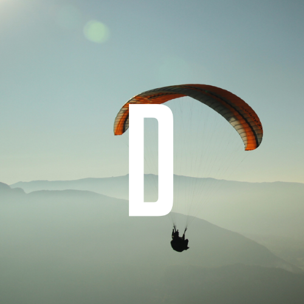
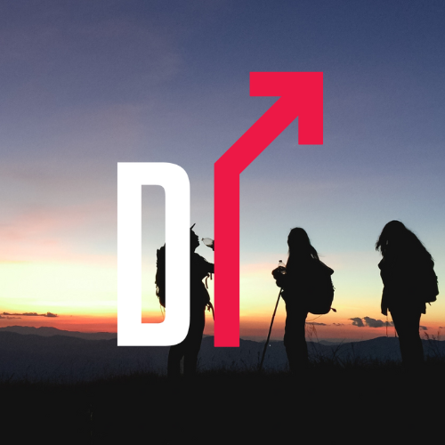
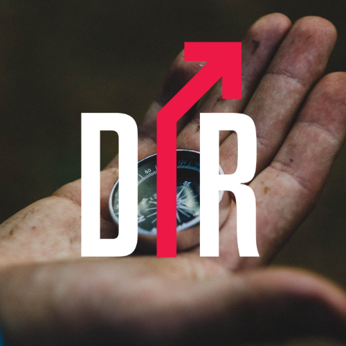
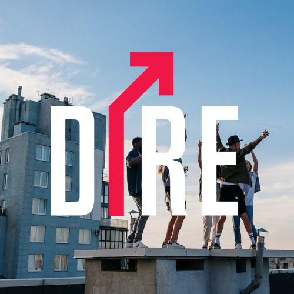
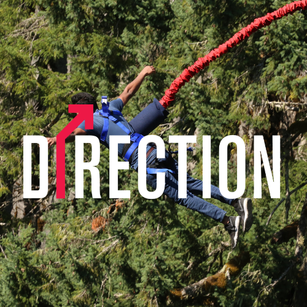
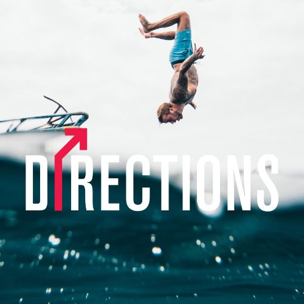

# Directions2022 Mini-game (No-coding needed)

* Source code: https://github.com/liyupi/daxigua
* Image customizing: https://daxigua-tools.liyupi.com/

# Making a bigger ball by combining small balls!
### The bigger the number, the ball gets bigger and it has more character!
### There is a chain reaction and the Directions logo is shown.

| Image 1 | Image 2 | Image 3 | Image 4 |
|-------|-------|-------|-------|
|||||
| Image 5 | Image 6 | Image 7 | Image 8 |
|||||
| Image 9 | Image 10 | Image 11 | 
||||

## Visual

## Sounds
### If user double tab the screen, user can hear the `pop` sounds.
