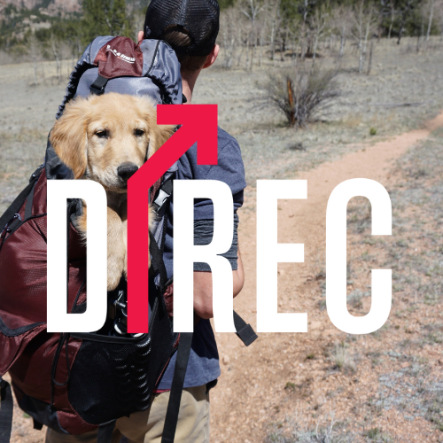

# Directions2022 Mini-game (No-coding needed)

* Source code: https://github.com/liyupi/daxigua
* Image customizing: https://daxigua-tools.liyupi.com/

# LET'S PLAY 🎮
* Link : https://devsamlee.github.io/directions-minigame/

# HOW TO PLAY - Making a bigger ball by combining small balls!
* The bigger the number, the ball gets bigger and it has more character!
* The chain reaction shows the Directions2022's logo.

| Image 1 | Image 2 | Image 3 | Image 4 |
|-------|-------|-------|-------|
|||||
| Image 5 | Image 6 | Image 7 | Image 8 |
|||||
| Image 9 | Image 10 | Image 11 | Image 12 |
|||||

## Visual
| Play screen | Line Warning |
|-------|-------|
| When the user touches the screen, the ball will be dropped. | When the top of the ball is close to the top, the line warning will show. |
|||

| The End | Try Again? | 
|-------|-------|
| When the ball touches the line, the game will be stopped. | The user can see the score and the try-again button will be displayed. |
|||

## Sounds
### If user double tab the screen, user can hear the `pop` sounds.
